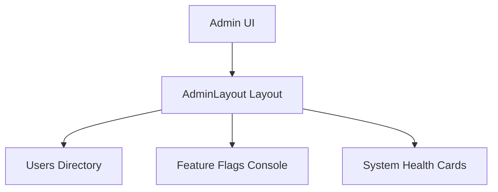

# Admin & Operations Platform Overview

DevLaunchKit includes a full-featured Operations Platform. Administrators can manage users, organizations, feature flags, and observe system health telemetry logs.

## Security Credentials

Operations controls are scoped behind Role-Based Access Control (RBAC):

- `Admin`: full operational capabilities.
- `Support Agent`: manage tickets and user states.
- `Developer`: toggle feature flags and inspect log files.
