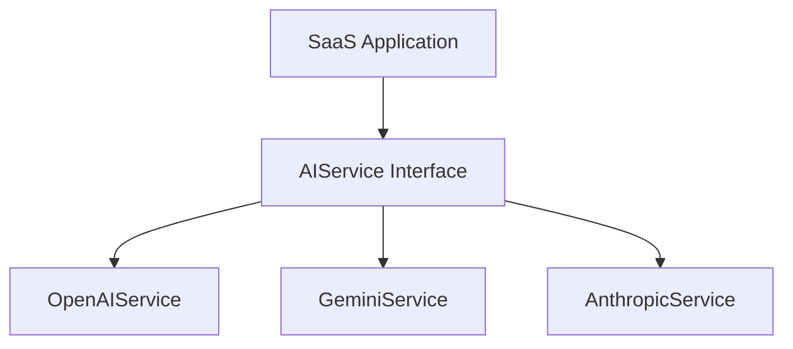

# AI Platform Overview

DevLaunchKit includes a provider-agnostic AI Platform. The core application logic references a centralized `AIService` interface rather than interacting directly with specific APIs (like OpenAI, Google Gemini, or Anthropic Claude).

## Key Capabilities

1.  **Multiple Providers Support**: Switch between OpenAI, Google Gemini, and Anthropic Claude with configuration variables.
2.  **Modular Checkouts**: Generates text responses, stream chunks, structured JSON objects, and embeddings.
3.  **Local Mock fallbacks**: Complete offline emulation modes for development environments.
4.  **Cost & Usage Trackers**: Observability layer to trace latency, input/output tokens, and costs.
