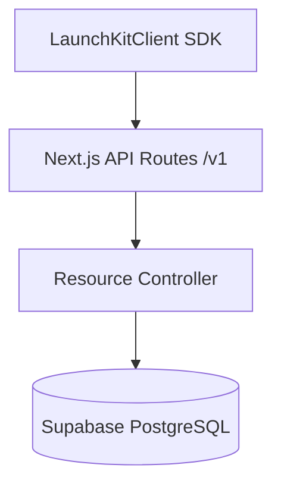

# API Platform Architecture

DevLaunchKit includes a unified API Platform to standardize and manage all external REST operations and internal fetch protocols.



## Standardized Envelopes

Every endpoint returns a unified JSON format:

```json
{
  "success": true,
  "data": { "userId": "usr_123" },
  "meta": { "latency": 24 }
}
```

---

## Paginations Specs

Supports both offset and cursor pagination schemas:

- **Offset pagination**: `page` & `pageSize` controls.
- **Cursor pagination**: `nextCursor` & `hasMore` controls.
