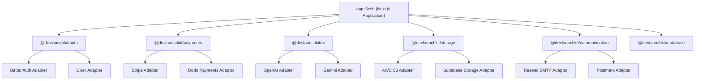

# Architecture Guide

A detailed architectural overview of the modular, decoupled DevLaunchKit codebase design.

---

## Purpose

This document explains the architectural patterns, folder conventions, and unidirectional dependency rules implemented in DevLaunchKit, enabling developers to scale the codebase cleanly without circular reference issues.

## Prerequisites

- Familiarity with Turborepo workspaces concept
- Understanding of Next.js App Router and Server Components

---

## Decoupled Architecture Design

DevLaunchKit avoids hardcoded dependencies on specific third-party integration vendors. Every critical platform capability—Authentication, Payments, AI, Storage, and Communication—is decoupled using provider-agnostic interfaces.



---

## Workspace Layout Conventions

```
LaunchKit/
├── apps/                    # Direct User-Facing Applications
│   └── web/                 # Next.js 15 Web Application
├── packages/                # Decoupled Workspace Modules
│   ├── ui/                  # Design System UI Library
│   ├── auth/                # Auth services & adapters
│   ├── database/            # Drizzle database client & migrations
│   ├── payments/            # Billing & stripe checkout wrapper
│   ├── ai/                  # Multi-LLM provider gateway
│   └── ...                  # Reusable utilities, configurations, & types
```

### Unidirectional Dependency Rules

To prevent spaghetti imports, we enforce strict dependency directions:

1. **No Circular Imports**: A package in `packages/` must not import code from `apps/`.
2. **Horizontal Isolations**: Packages should avoid tightly coupling to other heavy packages. For example, `@devlaunchkit/ui` must remain completely headless and generic, never importing database schema models.
3. **Internal Workspace References**: Monorepo packages import other internal packages via `workspace:*` npm links inside their local `package.json` file.

---

## Screenshots Placeholder


_Mermaid representation of monorepo package layer hierarchy._

---

## Best Practices

- **Export from Index**: Always export public components, utility helpers, and service factory methods from each package's main `src/index.ts` file.
- **Strict Separation of Concerns**: Keep provider-specific client initializations scoped inside their designated package folders, injecting credentials via generic constructors.

## Common Mistakes

- **Cross-Importing Apps**: Attempting to import files from `apps/web` into `@devlaunchkit/ui` or other shared packages. This breaks compilation and build isolation.
- **Hardcoding Providers**: Writing Stripe-specific API calls directly inside Next.js page components instead of utilizing the `@devlaunchkit/payments` billing service client.

---

## Troubleshooting

- **Circular Workspace Reference Error**:
  - Run `pnpm list --depth 1` to audit the monorepo package tree.
  - Inspect the workspace imports in the files flagged by the typescript error logs, refactoring shared types into `@devlaunchkit/types` if needed to resolve cross-package dependencies.
