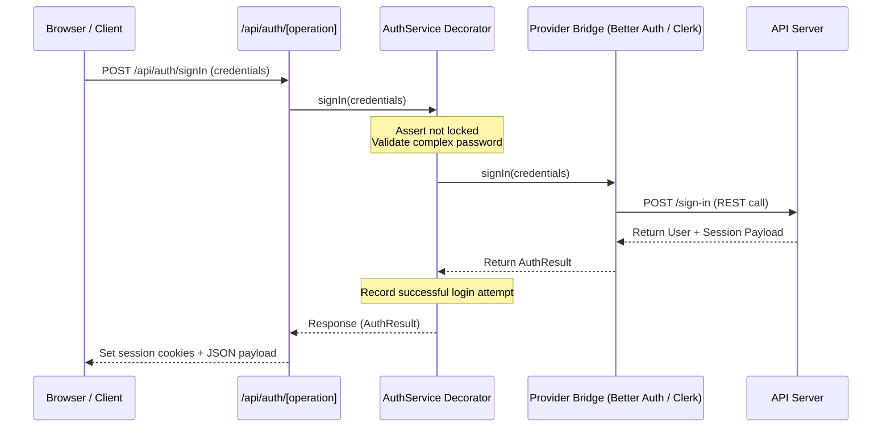
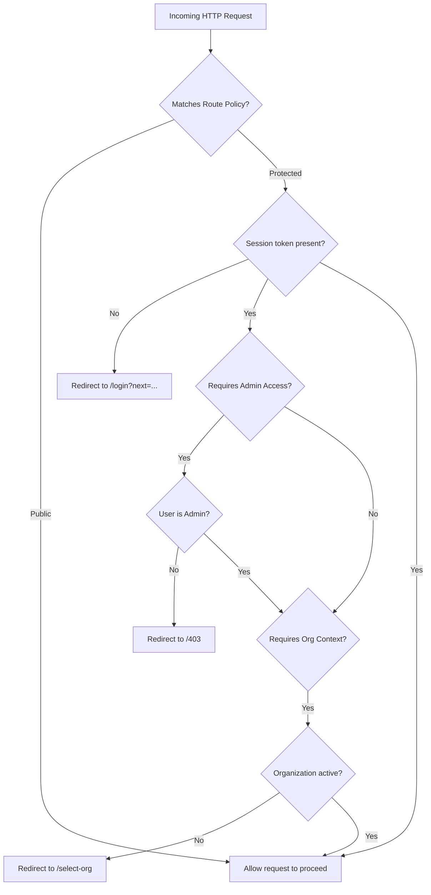

# Authentication Flow & Routing Sequence

This document describes the routing flows, middleware checks, and callback sequences when a user interacts with the DevLaunchKit Authentication Platform.

---

## 1. Sign In / Sign Up Flow

The client invokes the auth platform, which routes the request to our API dispatcher:

---

## 2. Protected Routes Middleware Verification

