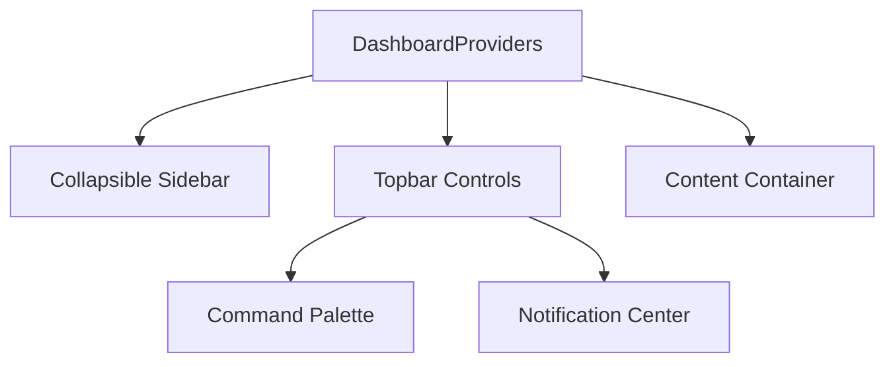

# Reusable Dashboard Framework

LaunchKit includes a premium, responsive, and highly accessible dashboard framework that SaaS applications built with LaunchKit inherit.

## Key Capabilities

1.  **Fully Responsive Layouts**: Automatically switches between desktop sidebar navigation drawers and mobile bottom-bar widgets.
2.  **Command Console Search**: Keyboard navigation-friendly console matching search terms to commands and setting shortcuts.
3.  **Active Session Switchers**: Workspace organization and member roster tables directly bound to context stores.
4.  **Audit Logs Timeline**: Simple audit logs stream for user operations.
5.  **A11y Compliant**: Focus indicators, reduced motion properties, and ARIA labels.
