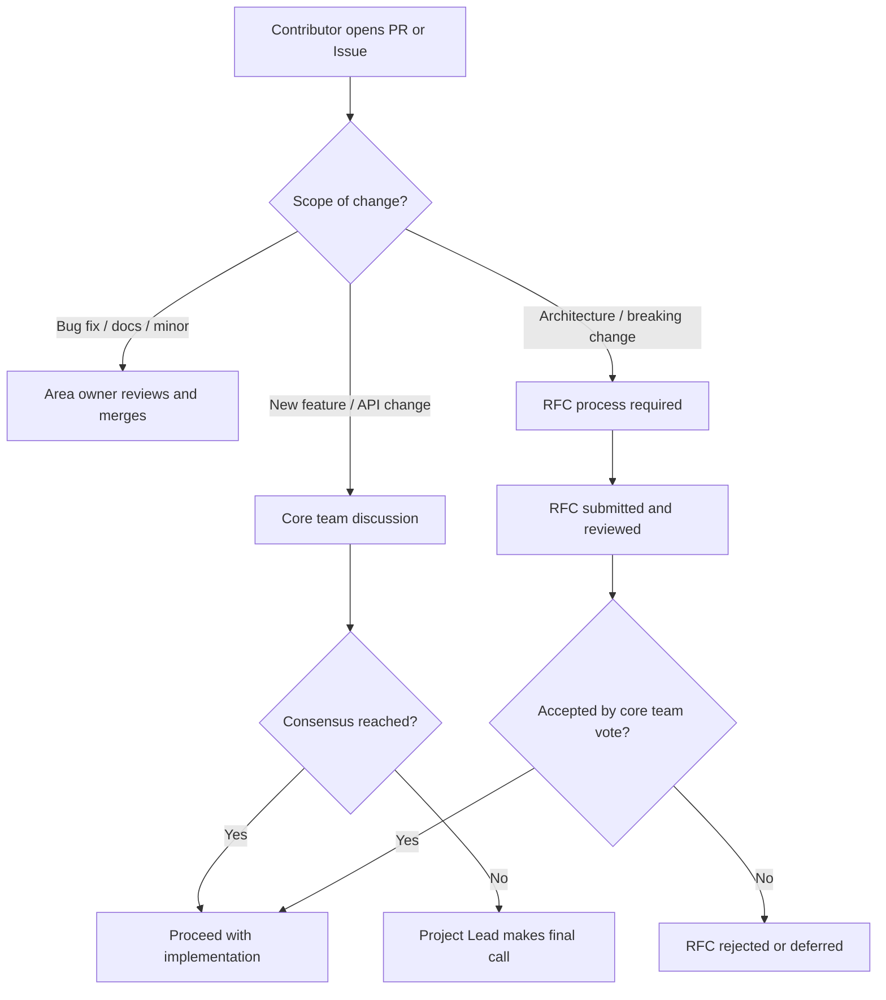

# Project Governance

This document describes the governance model for the DevLaunchKit project. It defines how decisions are made, how contributors advance through roles, and how conflicts are resolved.

---

## Decision-Making Model

DevLaunchKit uses a **Benevolent Dictator + Core Team Consensus** model, adapted from established open-source governance frameworks.

### How It Works

- **Day-to-day decisions** (bug fixes, minor features, documentation) are made by individual maintainers within their area of ownership.
- **Significant decisions** (new packages, architectural changes, dependency additions) require consensus among the core team, reached through discussion in GitHub Issues, Discussions, or the `#maintainers` Discord channel.
- **Strategic decisions** (roadmap direction, breaking changes, governance updates, branding) are made by the Project Lead after consulting the core team. The Project Lead has final authority when consensus cannot be reached.

### Decision Escalation Path



---

## RFC Process

Significant changes to DevLaunchKit require a Request for Comments (RFC) to ensure community input and thoughtful design.

### When an RFC Is Required

- Adding or removing a workspace package
- Changes to public API contracts that affect downstream consumers
- New external service integrations or provider abstractions
- Modifications to the build system, CI/CD pipeline, or deployment architecture
- Changes to project governance, licensing, or the Code of Conduct
- Any change that two or more core team members believe warrants broader discussion

### RFC Lifecycle

| Stage | Description | Duration |
| :--- | :--- | :--- |
| **Draft** | Author opens a GitHub Discussion in the "Ideas" category with the `rfc` label | No limit |
| **Review** | Core team and community provide feedback; author iterates on the proposal | Minimum 7 days |
| **Final Comment Period (FCP)** | A core team member motions to accept, reject, or postpone; 5-day countdown begins | 5 days |
| **Accepted** | The RFC is merged into `docs/rfcs/` and implementation begins | — |
| **Rejected** | The RFC is closed with a rationale; may be revisited in the future | — |
| **Postponed** | The RFC is valid but not a current priority; revisited quarterly | — |

### RFC Template

```markdown
# RFC: [Title]

## Summary
One-paragraph explanation of the proposal.

## Motivation
Why are we doing this? What problem does it solve? What use cases does it support?

## Detailed Design
Technical description of the proposed changes. Include code examples, API
signatures, database schema changes, and architectural diagrams where applicable.

## Alternatives Considered
What other approaches were evaluated? Why were they rejected?

## Migration Strategy
How will existing users transition? Is backward compatibility maintained?

## Unresolved Questions
What aspects of the design are still under discussion?
```

---

## Voting Procedures

When consensus cannot be reached through discussion, formal voting is used.

### Eligible Voters

Only **Maintainers** and **Committers** (see Roles below) may cast binding votes. Contributors and community members may participate in discussion but do not hold a binding vote.

### Voting Rules

| Rule | Details |
| :--- | :--- |
| **Quorum** | A minimum of 3 core team members must participate for a vote to be valid |
| **Passing threshold** | Simple majority (>50%) for standard decisions |
| **Supermajority** | Two-thirds majority (≥67%) for governance changes, license changes, and removal of a core team member |
| **Voting period** | 5 business days from the call for votes |
| **Abstentions** | Do not count toward the total; only "for" and "against" votes are tallied |
| **Tie-breaking** | The Project Lead casts the deciding vote |

### Voting Process

1. A core team member calls for a vote by posting in the relevant GitHub Discussion with the `vote` label
2. Each eligible voter responds with **+1** (for), **-1** (against), or **0** (abstain), along with a brief rationale
3. After the voting period closes, the result is recorded in the Discussion thread
4. The decision is documented in the relevant RFC or issue

---

## Roles

DevLaunchKit recognizes four community roles with increasing levels of responsibility and trust.

### Contributor

**Who:** Anyone who has contributed to the project in any form — code, documentation, bug reports, community support, translations, or design.

**Permissions:**
- Open issues and pull requests
- Participate in GitHub Discussions and Discord
- Attend community office hours and meetups

**Recognition:** Listed in release notes and the Contributors section of the README.

### Committer

**Who:** Trusted contributors who have demonstrated consistent, high-quality contributions and a deep understanding of at least one area of the codebase.

**Permissions:**
- Everything a Contributor can do
- Merge pull requests within their designated area (with one approval)
- Triage and label issues
- Participate in RFC discussions with advisory input

**Expectations:**
- Review at least 2 PRs per month in their area
- Respond to tagged issues within 5 business days
- Follow the commit and code style guidelines

### Maintainer

**Who:** Core team members responsible for the overall health, direction, and quality of the project.

**Permissions:**
- Everything a Committer can do
- Cast binding votes on project decisions
- Approve and merge PRs across all areas
- Manage releases and publish packages
- Administer the GitHub repository (labels, milestones, branch protection)
- Moderate community channels

**Expectations:**
- Participate in on-call rotation
- Attend monthly core team sync meetings
- Actively contribute to roadmap planning and prioritization
- Mentor Committers and Contributors

### Project Lead

**Who:** The founder and overall steward of DevLaunchKit.

**Permissions:**
- Everything a Maintainer can do
- Final decision authority when consensus cannot be reached
- Approve governance and licensing changes
- Manage project finances and partnerships
- Appoint and remove Maintainers

---

## Promotion Criteria

Advancement through roles is based on demonstrated merit, not tenure.

### Contributor → Committer

A Contributor may be nominated for the Committer role when they have:

- Authored at least **10 merged pull requests** demonstrating code quality and project understanding
- Participated in **5 or more issue discussions** or PR reviews with constructive feedback
- Demonstrated knowledge of the project architecture and coding standards
- Shown consistent engagement over at least **3 months**
- Received a nomination from an existing Maintainer, seconded by at least one other Maintainer

### Committer → Maintainer

A Committer may be nominated for the Maintainer role when they have:

- Served as a Committer for at least **6 months**
- Reviewed at least **30 pull requests** with thorough, constructive feedback
- Led the implementation of at least **2 significant features or initiatives**
- Demonstrated the ability to make sound architectural decisions
- Shown leadership in mentoring Contributors and participating in community discussions
- Received a unanimous nomination from the existing Maintainers

### Promotion Process

1. A Maintainer opens a private nomination in the `#maintainers` Discord channel
2. The core team discusses the nomination for a minimum of 7 days
3. A vote is held following the standard voting procedures
4. If approved, the nominee is contacted privately and offered the role
5. Upon acceptance, access is granted and the change is announced publicly

### Stepping Down

Any role holder may step down at any time by notifying the Project Lead. Emeritus status is granted to recognize past contributions, and returning members may be fast-tracked through the promotion process.

---

## Conflict Resolution

Disagreements are a natural part of collaborative work. We resolve conflicts constructively and respectfully.

### Step 1: Direct Discussion

The involved parties should attempt to resolve the disagreement directly through GitHub comments, Discord, or a private conversation. Most technical disagreements are resolved at this stage through good-faith discussion and mutual respect.

### Step 2: Mediation

If direct discussion does not resolve the conflict, either party may request mediation by a neutral Maintainer who is not directly involved in the disagreement. The mediator will:

- Listen to both perspectives
- Identify common ground and areas of compromise
- Propose a resolution or path forward

### Step 3: Core Team Decision

If mediation fails, the issue is escalated to the full core team for discussion and a formal vote. The decision is binding and must be accepted by all parties.

### Step 4: Project Lead Ruling

In rare cases where the core team cannot reach consensus, the Project Lead makes the final determination. This authority is exercised sparingly and only after all other avenues have been exhausted.

### Code of Conduct Violations

Conflicts that involve violations of the [Code of Conduct](../CODE_OF_CONDUCT.md) are handled through the enforcement process described in that document, not through this governance conflict resolution process. Report violations to [security@devlaunchkit.dev](mailto:security@devlaunchkit.dev).

---

## Amendments

This governance document may be amended through the RFC process. Changes to governance require a **supermajority vote** (≥67%) of the Maintainer team and a **minimum 14-day review period** before the vote.

All historical versions of this document are preserved in the Git history.
