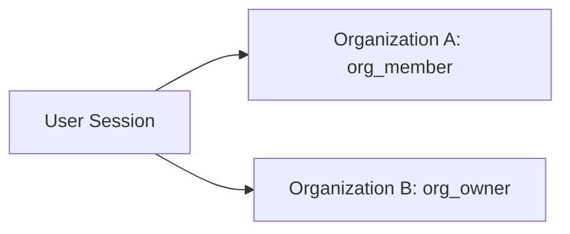

# Multi-Tenant & Organization Architectures

DevLaunchKit provides built-in multi-tenant organization workspaces, allowing users to belong to multiple organizations and switch between active workspaces.

---

## Workspace Contexts & Switching

Each authenticated request context optionally contains an active `organizationId`.



To switch organization contexts, the client makes a request to switch workspaces:

```typescript
import { useOrganization } from "@devlaunchkit/auth";

export function OrganizationSelector() {
  const { organization, switchOrganization } = useOrganization();

  return (
    <div>
      <p>Current Org: {organization?.name}</p>
      <button onClick={() => switchOrganization("usr_1", "org_2")}>
        Switch to Org 2
      </button>
    </div>
  );
}
```

---

## Reusable Switcher Components

### 1. `OrgSwitcherPopover`

Renders a popover switcher with user workspace choices, logo indicators, and active checkmarks.

### 2. `OrgMembersList`

Renders member tables with display names, roles, joined timestamps, and member removal triggers.

### 3. `OrgInvitationsList`

Renders pending invitation lists with access revoke actions.
