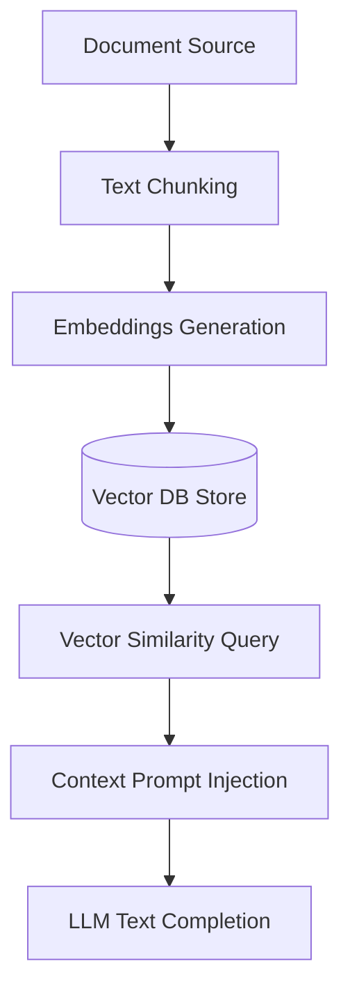

# Retrieval-Augmented Generation (RAG)

Architecture flow to ingest documents, generate embeddings, perform vector similarity search, and inject relevant context into LLM prompts.

---

## Processing Flow



---

## Vector Lookup Example

Retrieve context chunks to answer questions:

```typescript
const queryEmbedding = await ai.embed("How do I cancel my plan?");
const chunks = await database.querySimilarity(queryEmbedding.embedding);
```
