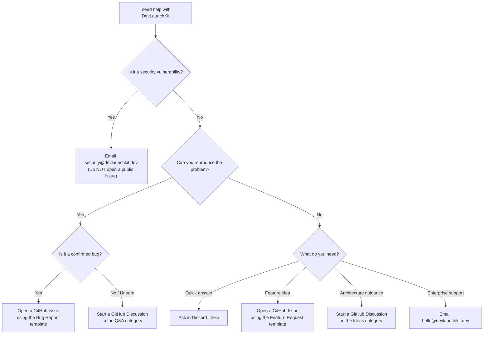

# Getting Support

Welcome to DevLaunchKit support. This guide helps you find the fastest path to an answer, whether you're debugging a local setup issue, reporting a bug, or evaluating enterprise features.

---

## Support Channels

| Channel                | Best For                                              | Link                                                                            |
| :--------------------- | :---------------------------------------------------- | :------------------------------------------------------------------------------ |
| **GitHub Issues**      | Confirmed bugs and actionable feature requests        | [Open an Issue](https://github.com/devlaunchkit/devlaunchkit/issues/new/choose) |
| **GitHub Discussions** | Architecture questions, "how do I…" queries, and RFCs | [Start a Discussion](https://github.com/devlaunchkit/devlaunchkit/discussions)  |
| **Discord**            | Real-time help, community chat, and pairing sessions  | [Join Discord](https://discord.gg/devlaunchkit)                                 |
| **Stack Overflow**     | Searchable Q&A (tag: `devlaunchkit`)                  | [Browse Questions](https://stackoverflow.com/questions/tagged/devlaunchkit)     |
| **Security Reports**   | Vulnerabilities and security-sensitive disclosures    | [security@devlaunchkit.dev](mailto:security@devlaunchkit.dev)                   |
| **Email**              | Enterprise inquiries and partnership discussions      | [hello@devlaunchkit.dev](mailto:hello@devlaunchkit.dev)                         |

> **Note:** GitHub Issues are for **confirmed bugs** and **well-defined feature requests** only. If you are unsure whether something is a bug, please start with GitHub Discussions or Discord first.

---

## Choosing the Right Channel

Use this flowchart to determine where to go:

---

## Response Time Expectations

We are an open-source project maintained by volunteers and a small core team. While we strive to be responsive, please set expectations accordingly.

| Channel                           | First Response         | Resolution Target                         |
| :-------------------------------- | :--------------------- | :---------------------------------------- |
| **Security Reports**              | Within 24 hours        | Patch within 72 hours for critical issues |
| **GitHub Issues (critical bugs)** | Within 48 hours        | Next patch release                        |
| **GitHub Issues (general)**       | Within 5 business days | Triaged and labeled within 7 days         |
| **GitHub Discussions**            | Within 3 business days | Community-driven; no guaranteed SLA       |
| **Discord**                       | Best-effort, same day  | Community-driven; no guaranteed SLA       |
| **Enterprise Support**            | Within 1 business day  | Per SLA agreement                         |

> These are targets, not guarantees. During release cycles, response times may be longer. Critical security issues always take priority.

---

## How to File an Effective Bug Report

A well-written bug report dramatically increases the chance of a quick fix. Please include:

### Required Information

1. **Clear title** — Summarize the bug in one sentence (e.g., "Auth middleware returns 500 on expired JWT tokens")
2. **Environment details** — Node.js version, OS, package manager version, and relevant package versions
3. **Steps to reproduce** — Numbered, minimal steps that reliably trigger the issue
4. **Expected behavior** — What you thought should happen
5. **Actual behavior** — What actually happened, including error messages and stack traces

### Highly Recommended

6. **Minimal reproduction** — A link to a stripped-down repository or a code snippet that isolates the problem
7. **Screenshots or recordings** — For UI bugs, attach screenshots or a short screen recording
8. **Logs** — Relevant terminal output, browser console errors, or server logs (redact secrets)

### Example of a Good Bug Report Title

| ❌ Poor           | ✅ Good                                                                    |
| :---------------- | :------------------------------------------------------------------------- |
| "It doesn't work" | "pnpm dev fails with EADDRINUSE on port 3000 after hot reload"             |
| "Auth is broken"  | "OAuth callback returns 403 when using Google provider with custom domain" |
| "Help needed"     | "Drizzle migration fails on PostgreSQL 16 with enum type conflict"         |

---

## Before You Open an Issue

Save yourself (and us) time by checking these resources first:

1. **[FAQ](./FAQ.md)** — Answers to the most commonly asked questions
2. **[Troubleshooting Guide](./TROUBLESHOOTING.md)** — Step-by-step solutions for known issues
3. **[Installation Guide](./INSTALLATION.md)** — Environment setup and prerequisite verification
4. **[Existing Issues](https://github.com/devlaunchkit/devlaunchkit/issues)** — Search for duplicates before filing
5. **[Existing Discussions](https://github.com/devlaunchkit/devlaunchkit/discussions)** — Your question may already be answered

---

## Enterprise Support

For organizations that need guaranteed response times, dedicated support channels, and architectural guidance, we offer enterprise support plans.

### What's Included

- **Dedicated Slack/Discord channel** with direct access to core maintainers
- **Guaranteed SLA** with 4-hour response time for critical issues (business hours)
- **Priority bug fixes** and backport patches to your pinned version
- **Architecture reviews** and migration planning sessions (quarterly)
- **Custom feature development** prioritization for your use cases
- **Private security advisories** before public disclosure

### Getting Started

Contact us at **[hello@devlaunchkit.dev](mailto:hello@devlaunchkit.dev)** with:

- Your organization name and size
- Current or planned DevLaunchKit usage
- Support requirements and SLA expectations

We will respond within 1 business day with a tailored proposal.

---

## Community Guidelines

When participating in any support channel, please:

- **Be respectful** — Follow our [Code of Conduct](../CODE_OF_CONDUCT.md) at all times
- **Be specific** — Vague questions receive vague answers; include context and code
- **Be patient** — Maintainers are often in different time zones
- **Pay it forward** — If you solve your problem, share the solution so others benefit
- **Search first** — Check existing issues, discussions, and documentation before posting

---

## Useful Links

| Resource                                                         | Description                            |
| :--------------------------------------------------------------- | :------------------------------------- |
| [Documentation](https://devlaunchkit.dev/docs)                   | Full project documentation             |
| [Quick Start Guide](./QUICK_START.md)                            | Get up and running in minutes          |
| [Contributing Guide](../CONTRIBUTING.md)                         | How to contribute code, docs, and more |
| [Changelog](../CHANGELOG.md)                                     | Release notes and version history      |
| [Roadmap](https://github.com/devlaunchkit/devlaunchkit/projects) | Planned features and milestones        |
| [Security Policy](../SECURITY.md)                                | Responsible disclosure process         |
