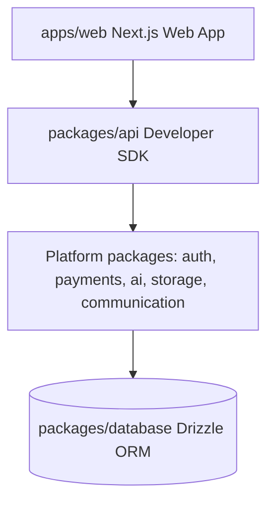

# System Architecture

DevLaunchKit utilizes a layered workspace architecture.

## Modular Abstractions

Every external vendor connection (e.g. Stripe, OpenAI, Resend) is decoupled behind a unified package interface to allow easy vendor swapping without refactoring the application code.
