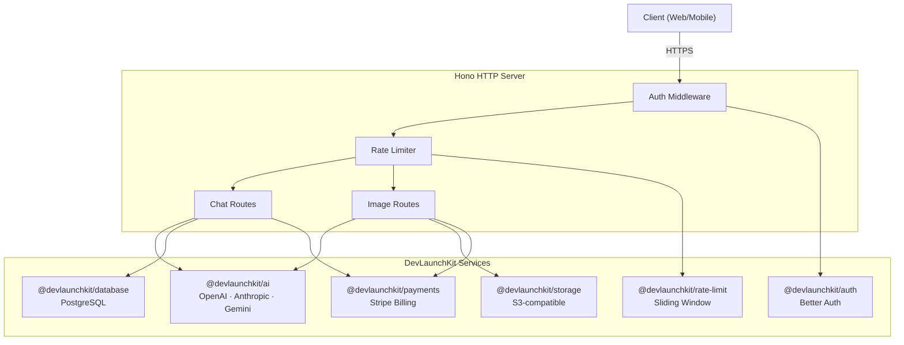

# 🤖 AI Chat & Image Generation SaaS

[](https://www.typescriptlang.org/)
[](https://nodejs.org/)
[](https://github.com/devlaunchkit)

A production-ready AI-powered SaaS application demonstrating multi-provider LLM chat completions and image generation with subscription billing, user authentication, and persistent conversation history.

## Architecture



## Features

- **Multi-Provider AI** — Seamlessly switch between OpenAI GPT-4o, Anthropic Claude, and Google Gemini
- **Streaming Chat** — Real-time SSE streaming for token-by-token chat responses
- **Image Generation** — DALL·E 3 powered image creation with automatic cloud storage
- **Conversation History** — Full conversation persistence with search and pagination
- **Subscription Billing** — Stripe-powered tiered plans (Free / Pro / Enterprise) with usage tracking
- **Authentication** — Better Auth with email/password and OAuth support
- **Rate Limiting** — Per-user sliding window rate limits based on subscription tier
- **Credit System** — Token-based credit tracking with automatic plan enforcement

## Folder Structure

```
examples/ai-saas/
├── src/
│   ├── index.ts              # Main server entrypoint with Hono
│   ├── middleware/
│   │   └── auth.ts           # Authentication & authorization middleware
│   └── routes/
│       ├── chat.ts           # Chat completion & conversation endpoints
│       └── images.ts         # Image generation & gallery endpoints
├── package.json
├── tsconfig.json
└── README.md
```

## Environment Variables

| Variable | Description | Required | Default |
|---|---|---|---|
| `PORT` | HTTP server port | No | `3000` |
| `NODE_ENV` | Runtime environment | No | `development` |
| `DATABASE_URL` | PostgreSQL connection string | Yes | — |
| `OPENAI_API_KEY` | OpenAI API key for GPT & DALL·E | Yes | — |
| `ANTHROPIC_API_KEY` | Anthropic API key for Claude | No | — |
| `GEMINI_API_KEY` | Google Gemini API key | No | — |
| `STRIPE_SECRET_KEY` | Stripe secret API key | Yes | — |
| `STRIPE_WEBHOOK_SECRET` | Stripe webhook signing secret | Yes | — |
| `STRIPE_PRICE_PRO` | Stripe Price ID for Pro plan | Yes | — |
| `STRIPE_PRICE_ENTERPRISE` | Stripe Price ID for Enterprise plan | Yes | — |
| `BETTER_AUTH_SECRET` | Better Auth signing secret | Yes | — |
| `BETTER_AUTH_URL` | Better Auth callback URL | Yes | — |
| `STORAGE_BUCKET` | S3-compatible bucket name | Yes | — |
| `STORAGE_REGION` | S3 region | No | `us-east-1` |

## Quick Start

```bash
# 1. Navigate to the example directory
cd examples/ai-saas

# 2. Install dependencies from workspace root
pnpm install

# 3. Copy environment template and fill in values
cp .env.example .env

# 4. Run database migrations
pnpm db:migrate

# 5. Start the development server
pnpm dev
```

## API Endpoints

| Method | Endpoint | Description | Auth |
|---|---|---|---|
| `POST` | `/api/chat/completions` | Stream chat completion response | ✅ |
| `GET` | `/api/chat/conversations` | List user conversations | ✅ |
| `GET` | `/api/chat/conversations/:id` | Get conversation with messages | ✅ |
| `DELETE` | `/api/chat/conversations/:id` | Delete a conversation | ✅ |
| `POST` | `/api/images/generate` | Generate an image from prompt | ✅ |
| `GET` | `/api/images` | List generated images | ✅ |
| `GET` | `/api/images/:id` | Get image details and signed URL | ✅ |
| `DELETE` | `/api/images/:id` | Delete a generated image | ✅ |

## Deployment Guide

### Docker

```dockerfile
FROM node:20-alpine AS builder
WORKDIR /app
COPY . .
RUN pnpm install --frozen-lockfile
RUN pnpm --filter @devlaunchkit/example-ai-saas build

FROM node:20-alpine
WORKDIR /app
COPY --from=builder /app .
EXPOSE 3000
CMD ["node", "examples/ai-saas/dist/index.js"]
```

### Vercel / Railway / Fly.io

1. Set the root directory to `examples/ai-saas`
2. Set build command: `pnpm build`
3. Set start command: `node dist/index.js`
4. Configure all environment variables from the table above

### Production Checklist

- [ ] Set `NODE_ENV=production`
- [ ] Configure Stripe webhook endpoint to `https://yourdomain.com/api/webhooks/stripe`
- [ ] Enable Stripe test mode for staging environments
- [ ] Set appropriate rate limits for each subscription tier
- [ ] Configure S3 bucket CORS policies for image access
- [ ] Set up database connection pooling
