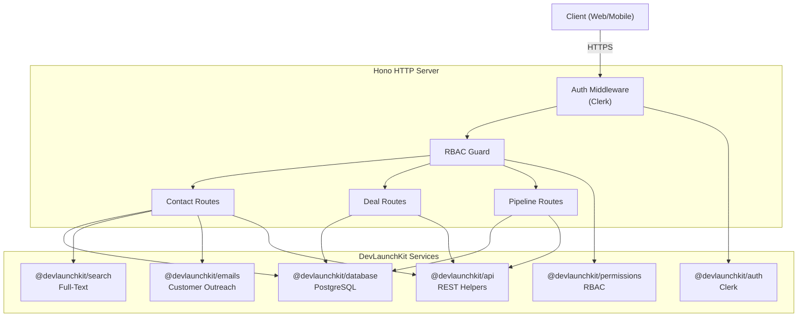

# 📇 Customer Relationship Manager (CRM)

[](https://www.typescriptlang.org/)
[](https://nodejs.org/)
[](https://github.com/devlaunchkit)

A full-featured CRM backend demonstrating contact management, deal pipelines, full-text search, role-based access control, and automated customer outreach — all built on DevLaunchKit's composable package ecosystem.

## Architecture



## Features

- **Contact Management** — Full CRUD for customers and leads with rich metadata, notes, and tagging
- **Deal Pipeline** — Kanban-style deal tracking across customizable pipeline stages
- **Full-Text Search** — Lightning-fast search across contacts, companies, and deals
- **Role-Based Access** — Owner / Admin / Member / Viewer roles with granular permissions
- **Team Authentication** — Clerk-powered multi-tenant team authentication with SSO
- **Customer Outreach** — Templated email sending with delivery tracking
- **Activity Timeline** — Automatic activity logging for all CRM actions
- **Paginated API** — Standards-compliant REST API with cursor and offset pagination

## Folder Structure

```
examples/crm/
├── src/
│   ├── index.ts                # Main server entrypoint
│   ├── routes/
│   │   ├── contacts.ts         # Contact CRUD & outreach endpoints
│   │   ├── deals.ts            # Deal management & stage transitions
│   │   └── pipeline.ts         # Pipeline configuration & analytics
│   └── services/
│       └── search.ts           # Full-text search indexing & queries
├── package.json
├── tsconfig.json
└── README.md
```

## Environment Variables

| Variable | Description | Required | Default |
|---|---|---|---|
| `PORT` | HTTP server port | No | `3001` |
| `NODE_ENV` | Runtime environment | No | `development` |
| `DATABASE_URL` | PostgreSQL connection string | Yes | — |
| `CLERK_SECRET_KEY` | Clerk backend API key | Yes | — |
| `CLERK_PUBLISHABLE_KEY` | Clerk frontend publishable key | Yes | — |
| `RESEND_API_KEY` | Resend API key for email outreach | Yes | — |
| `EMAIL_FROM` | Default sender email address | No | `crm@yourdomain.com` |

## Quick Start

```bash
# 1. Navigate to the example directory
cd examples/crm

# 2. Install dependencies from workspace root
pnpm install

# 3. Copy environment template and fill in values
cp .env.example .env

# 4. Run database migrations
pnpm db:migrate

# 5. Start the development server
pnpm dev
```

## API Endpoints

### Contacts

| Method | Endpoint | Description | Role |
|---|---|---|---|
| `GET` | `/api/contacts` | List contacts (paginated, filterable) | Viewer+ |
| `POST` | `/api/contacts` | Create a new contact | Member+ |
| `GET` | `/api/contacts/:id` | Get contact details | Viewer+ |
| `PUT` | `/api/contacts/:id` | Update a contact | Member+ |
| `DELETE` | `/api/contacts/:id` | Delete a contact | Admin+ |
| `POST` | `/api/contacts/:id/email` | Send outreach email | Member+ |
| `GET` | `/api/contacts/search` | Full-text search contacts | Viewer+ |

### Deals

| Method | Endpoint | Description | Role |
|---|---|---|---|
| `GET` | `/api/deals` | List deals (paginated, filterable) | Viewer+ |
| `POST` | `/api/deals` | Create a new deal | Member+ |
| `GET` | `/api/deals/:id` | Get deal details | Viewer+ |
| `PUT` | `/api/deals/:id` | Update a deal | Member+ |
| `PATCH` | `/api/deals/:id/stage` | Move deal to different stage | Member+ |
| `DELETE` | `/api/deals/:id` | Delete a deal | Admin+ |

### Pipeline

| Method | Endpoint | Description | Role |
|---|---|---|---|
| `GET` | `/api/pipeline` | Get pipeline configuration | Viewer+ |
| `GET` | `/api/pipeline/summary` | Pipeline analytics summary | Viewer+ |
| `PUT` | `/api/pipeline/stages` | Update pipeline stages | Admin+ |
| `GET` | `/api/pipeline/forecast` | Revenue forecast | Admin+ |

## Deployment Guide

### Docker

```dockerfile
FROM node:20-alpine AS builder
WORKDIR /app
COPY . .
RUN pnpm install --frozen-lockfile
RUN pnpm --filter @devlaunchkit/example-crm build

FROM node:20-alpine
WORKDIR /app
COPY --from=builder /app .
EXPOSE 3001
CMD ["node", "examples/crm/dist/index.js"]
```

### Production Checklist

- [ ] Set `NODE_ENV=production`
- [ ] Configure Clerk webhook endpoint for user sync
- [ ] Set up PostgreSQL connection pooling
- [ ] Configure Resend domain verification for email deliverability
- [ ] Enable database backups and point-in-time recovery
- [ ] Set appropriate CORS origins for your frontend domain
