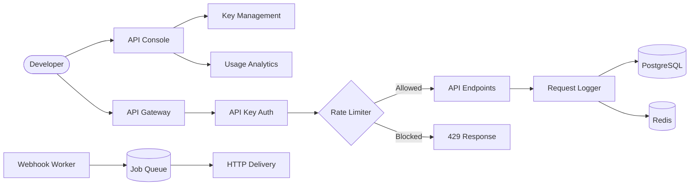

# 🔧 Developer Tool

> Developer console and API gateway with tiered rate limiting, API key management, usage analytics, and background webhook delivery — built with DevLaunchKit.

## Architecture



## Features

- **API key management** — create, list, and revoke keys with tiered permissions
- **Tiered rate limiting** — free (100/hr), starter (1K/hr), pro (10K/hr), enterprise (100K/hr)
- **Usage analytics** — request counts, latency percentiles (p95), hourly breakdown, top endpoints
- **Request logging** — every API call logged with method, path, status, latency, and API key
- **Webhook delivery** — background worker with exponential backoff retries (up to 5 attempts)
- **HMAC signatures** — SHA-256 webhook payload signing for consumer verification
- **Standard headers** — `X-RateLimit-Limit`, `X-RateLimit-Remaining`, `X-RateLimit-Reset`
- **Key security** — keys hashed with SHA-256, secrets shown only once at creation

## Folder Structure

```
developer-tool/
├── src/
│   ├── index.ts                  # Express server & request logging
│   ├── routes/
│   │   ├── keys.ts               # API key CRUD
│   │   └── usage.ts              # Usage analytics
│   ├── middleware/
│   │   └── rate-limit.ts         # Tiered rate limiting
│   └── workers/
│       └── webhook-delivery.ts   # Background webhook processor
├── package.json
├── tsconfig.json
└── README.md
```

## Environment Variables

| Variable                 | Description                                           | Required |
| ------------------------ | ----------------------------------------------------- | -------- |
| `DATABASE_URL`           | PostgreSQL connection string                          | Yes      |
| `REDIS_URL`              | Redis connection string (for rate limiting & caching) | Yes      |
| `WEBHOOK_SIGNING_SECRET` | HMAC secret for webhook signatures                    | Yes      |
| `PORT`                   | Server port (default: `4004`)                         | No       |

## Quick Start

```bash
# 1. Navigate to the example
cd examples/developer-tool

# 2. Install dependencies
pnpm install

# 3. Configure environment
cp ../../.env.example .env
# Edit .env with your database and Redis connection strings

# 4. Start the API server
pnpm dev

# 5. In a separate terminal, start the webhook worker
pnpm worker
```

## API Endpoints

| Method   | Path                | Description                             | Auth    |
| -------- | ------------------- | --------------------------------------- | ------- |
| `POST`   | `/api/keys`         | Create a new API key                    | None    |
| `GET`    | `/api/keys`         | List all API keys                       | None    |
| `DELETE` | `/api/keys/:id`     | Revoke an API key                       | None    |
| `GET`    | `/api/usage`        | Usage statistics (`?keyId=&period=24h`) | None    |
| `GET`    | `/api/v1/echo`      | Echo endpoint                           | API Key |
| `POST`   | `/api/v1/transform` | Text transform endpoint                 | API Key |
| `GET`    | `/health`           | Health check                            | None    |

## Rate Limit Tiers

| Tier         | Requests/Hour | Use Case                     |
| ------------ | ------------- | ---------------------------- |
| `free`       | 100           | Evaluation and testing       |
| `starter`    | 1,000         | Side projects and prototypes |
| `pro`        | 10,000        | Production applications      |
| `enterprise` | 100,000       | High-traffic services        |

## Deployment

```bash
# Build for production
pnpm build

# Start API server
NODE_ENV=production node dist/index.js

# Start webhook worker (separate process)
NODE_ENV=production node dist/workers/webhook-delivery.js
```
