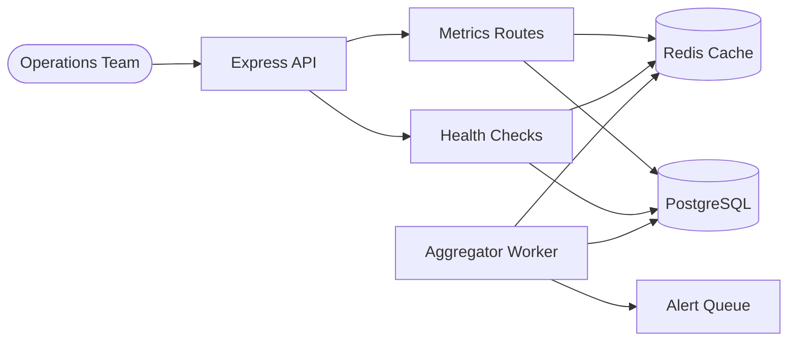

# 📊 Internal Dashboard

> Operations metrics dashboard with real-time counters, background aggregation workers, Redis caching, and structured logging — built with DevLaunchKit.

## Architecture



## Features

- **System metrics** — memory, CPU, uptime, Node.js version, and event loop data
- **Business KPIs** — user growth, active subscriptions, revenue, churn rate, daily revenue trends
- **Health checks** — dependency-aware status for PostgreSQL and Redis with latency tracking
- **Background aggregation** — hourly metric computations running in a standalone worker process
- **Redis caching** — cache-aside pattern with configurable TTLs for fast dashboard loads
- **Alert thresholds** — automatic alert enqueuing when error rates exceed 5%
- **Real-time counters** — incrementable Redis counters for page views, API calls, etc.
- **Structured logging** — JSON logs with service context via `@devlaunchkit/logger`

## Folder Structure

```
internal-dashboard/
├── src/
│   ├── index.ts                  # Express server with observability
│   ├── routes/
│   │   ├── metrics.ts            # System & business metric endpoints
│   │   └── health.ts             # Health check with dependency status
│   ├── workers/
│   │   └── aggregator.ts         # Background metric aggregation
│   └── services/
│       └── cache.ts              # Cache-aside pattern utilities
├── package.json
├── tsconfig.json
└── README.md
```

## Environment Variables

| Variable       | Description                   | Required |
| -------------- | ----------------------------- | -------- |
| `DATABASE_URL` | PostgreSQL connection string  | Yes      |
| `REDIS_URL`    | Redis connection string       | Yes      |
| `PORT`         | Server port (default: `4003`) | No       |

## Quick Start

```bash
# 1. Navigate to the example
cd examples/internal-dashboard

# 2. Install dependencies
pnpm install

# 3. Configure environment
cp ../../.env.example .env
# Edit .env with your database and Redis connection strings

# 4. Start the API server
pnpm dev

# 5. In a separate terminal, start the aggregation worker
pnpm worker
```

## API Endpoints

| Method | Path                       | Description                          |
| ------ | -------------------------- | ------------------------------------ |
| `GET`  | `/api/dashboard`           | Aggregate overview stats             |
| `GET`  | `/api/metrics/system`      | System metrics (memory, CPU, uptime) |
| `GET`  | `/api/metrics/business`    | Business KPIs with `?period=30d`     |
| `GET`  | `/api/health`              | Overall health status                |
| `GET`  | `/api/health/dependencies` | Detailed dependency checks           |

## Deployment

```bash
# Build for production
pnpm build

# Start API server
NODE_ENV=production node dist/index.js

# Start worker (separate process or container)
NODE_ENV=production node dist/workers/aggregator.js
```

Run the API server and aggregator worker as separate processes or containers. The worker auto-restarts aggregation cycles every 60 seconds.
