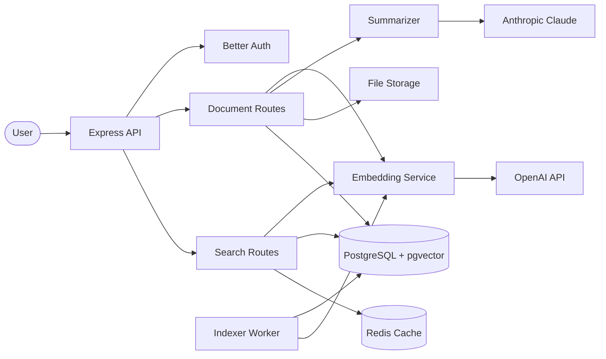

# 🧠 Knowledge Base

> AI-powered knowledge base with vector search, document summarization, and semantic retrieval — built with DevLaunchKit, OpenAI embeddings, Anthropic Claude, and pgvector.

## Architecture



## Features

- **Document ingestion** — upload text documents, automatically chunk, embed, and index
- **Vector search** — semantic similarity search using pgvector cosine distance
- **AI summarization** — document and search result summarization via Anthropic Claude
- **Embeddings** — OpenAI text-embedding-3-small with batched generation
- **Background indexing** — standalone worker process for bulk document imports
- **Search caching** — Redis cache for repeated queries (5-minute TTL)
- **Autocomplete** — title-based suggestion endpoint for search UI
- **File backup** — raw documents stored in S3/Supabase Storage
- **Chunking** — sentence-boundary-aware overlapping text chunks (1000 chars, 200 overlap)

## Folder Structure

```
knowledge-base/
├── src/
│   ├── index.ts                  # Express server & auth
│   ├── routes/
│   │   ├── documents.ts          # Document CRUD & indexing
│   │   └── search.ts             # Semantic search & autocomplete
│   ├── services/
│   │   ├── embeddings.ts         # OpenAI embedding generation
│   │   └── summarizer.ts         # Anthropic summarization
│   └── workers/
│       └── indexer.ts            # Background document indexer
├── package.json
├── tsconfig.json
└── README.md
```

## Environment Variables

| Variable | Description | Required |
|---|---|---|
| `DATABASE_URL` | PostgreSQL (with pgvector extension) connection string | Yes |
| `REDIS_URL` | Redis connection string | Yes |
| `OPENAI_API_KEY` | OpenAI API key for embeddings | Yes |
| `ANTHROPIC_API_KEY` | Anthropic API key for summarization | Yes |
| `BETTER_AUTH_SECRET` | Better Auth JWT secret | Yes |
| `STORAGE_PROVIDER` | Storage provider (`s3` or `supabase`) | Yes |
| `PORT` | Server port (default: `4005`) | No |

## Quick Start

```bash
# 1. Navigate to the example
cd examples/knowledge-base

# 2. Install dependencies
pnpm install

# 3. Enable pgvector in your PostgreSQL database
psql $DATABASE_URL -c "CREATE EXTENSION IF NOT EXISTS vector;"

# 4. Configure environment
cp ../../.env.example .env
# Edit .env with your API keys and database credentials

# 5. Start the API server
pnpm dev

# 6. In a separate terminal, start the background indexer
pnpm worker:indexer
```

## API Endpoints

| Method | Path | Description |
|---|---|---|
| `POST` | `/api/documents` | Upload and index a document |
| `GET` | `/api/documents/:id` | Get document with metadata |
| `DELETE` | `/api/documents/:id` | Delete document and chunks |
| `POST` | `/api/search` | Semantic search (`{query, limit, threshold, summarize}`) |
| `GET` | `/api/search/suggest?q=` | Autocomplete suggestions |
| `GET` | `/api/stats` | Collection statistics |
| `GET` | `/health` | Health check |

## Deployment

```bash
# Build for production
pnpm build

# Start API server
NODE_ENV=production node dist/index.js

# Start indexer worker (separate process)
NODE_ENV=production node dist/workers/indexer.js
```

Ensure your PostgreSQL instance has the `pgvector` extension enabled and sufficient disk for embedding storage (~6 KB per chunk).
