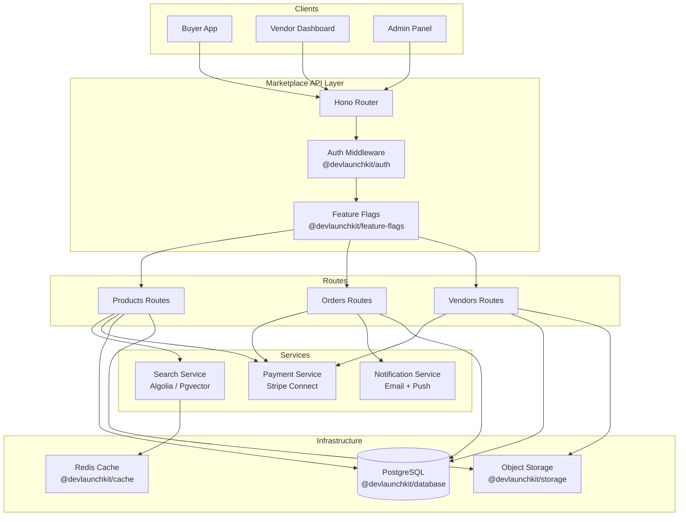

# 🏪 Multi-Vendor Marketplace

[](https://www.typescriptlang.org/)
[](https://nodejs.org/)
[](https://stripe.com/connect)
[](https://clerk.com/)
[](https://algolia.com/)

A production-ready multi-vendor marketplace backend demonstrating split payments via Stripe Connect, role-based vendor/buyer authentication, product image management, full-text search, feature flag rollouts, and real-time order notifications — all powered by DevLaunchKit packages.

## Architecture



## Features

- **Stripe Connect Split Payments** — Automatic revenue splitting between marketplace and vendors with configurable commission rates
- **Role-Based Authentication** — Clerk-powered auth with distinct buyer, vendor, and admin roles and permission scoping
- **Product Image Management** — Multi-image uploads with automatic thumbnail generation and signed URL delivery
- **Full-Text Product Search** — Algolia-backed instant search with faceted filtering by category, price range, and vendor
- **Feature Flag Rollouts** — Gradual feature releases with percentage-based rollouts and environment targeting
- **Order Lifecycle Notifications** — Email and push notifications for order placement, payment, shipment, and delivery
- **Vendor Onboarding** — Complete Stripe Connect onboarding flow with account link generation and webhook verification
- **Inventory Tracking** — Real-time stock management with low-inventory alerts and automatic listing deactivation

## Folder Structure

```
marketplace/
├── README.md
├── package.json
├── tsconfig.json
└── src/
    ├── index.ts                  # Application entry point & server bootstrap
    ├── routes/
    │   ├── products.ts           # Product CRUD, listing, image uploads
    │   ├── orders.ts             # Order placement, status tracking, refunds
    │   └── vendors.ts            # Vendor registration, onboarding, dashboard
    └── services/
        ├── payments.ts           # Stripe Connect integration & split logic
        └── search.ts             # Product search indexing & querying
```

## Environment Variables

| Variable | Description | Required | Default |
|---|---|---|---|
| `PORT` | HTTP server port | No | `4500` |
| `NODE_ENV` | Runtime environment | No | `development` |
| `DATABASE_URL` | PostgreSQL connection string | Yes | — |
| `STRIPE_SECRET_KEY` | Stripe API secret key | Yes | — |
| `STRIPE_WEBHOOK_SECRET` | Stripe webhook endpoint secret | Yes | — |
| `STRIPE_PLATFORM_ACCOUNT` | Platform Stripe account ID | Yes | — |
| `STRIPE_COMMISSION_RATE` | Platform commission percentage (0-100) | No | `10` |
| `CLERK_SECRET_KEY` | Clerk backend API key | Yes | — |
| `CLERK_PUBLISHABLE_KEY` | Clerk frontend publishable key | Yes | — |
| `STORAGE_BUCKET` | Object storage bucket for product images | No | `marketplace-images` |
| `ALGOLIA_APP_ID` | Algolia application ID | Yes | — |
| `ALGOLIA_ADMIN_KEY` | Algolia admin API key | Yes | — |
| `ALGOLIA_SEARCH_KEY` | Algolia public search-only key | Yes | — |
| `ALGOLIA_INDEX_NAME` | Algolia product index name | No | `products` |
| `NOTIFICATION_FROM_EMAIL` | Sender email for order notifications | No | `orders@marketplace.app` |

## Quick Start

### Prerequisites

- Node.js 20+
- pnpm 9+
- PostgreSQL 15+
- Stripe account with Connect enabled
- Clerk project
- Algolia account

### Setup

```bash
# 1. Navigate to the example directory
cd examples/marketplace

# 2. Install dependencies
pnpm install

# 3. Copy the environment template and fill in values
cp .env.example .env

# 4. Run database migrations
pnpm db:migrate

# 5. Seed sample data (optional)
pnpm db:seed

# 6. Start the development server
pnpm dev
```

The server starts at `http://localhost:4500` with structured request logging.

## API Endpoints

### Products

| Method | Path | Description | Auth |
|---|---|---|---|
| `GET` | `/api/products` | List products with pagination and filters | Public |
| `GET` | `/api/products/search` | Full-text search with facets | Public |
| `GET` | `/api/products/:id` | Get product details | Public |
| `POST` | `/api/products` | Create a new product | Vendor |
| `PUT` | `/api/products/:id` | Update product details | Vendor (owner) |
| `DELETE` | `/api/products/:id` | Soft-delete a product | Vendor (owner) |
| `POST` | `/api/products/:id/images` | Upload product images | Vendor (owner) |
| `DELETE` | `/api/products/:id/images/:imageId` | Remove a product image | Vendor (owner) |

### Orders

| Method | Path | Description | Auth |
|---|---|---|---|
| `GET` | `/api/orders` | List orders (buyer sees own, vendor sees their items) | Buyer / Vendor |
| `GET` | `/api/orders/:id` | Get order details | Buyer / Vendor |
| `POST` | `/api/orders` | Place a new order | Buyer |
| `PUT` | `/api/orders/:id/status` | Update order status (ship, deliver) | Vendor |
| `POST` | `/api/orders/:id/refund` | Request or process a refund | Buyer / Admin |
| `GET` | `/api/orders/:id/tracking` | Get shipment tracking info | Buyer |

### Vendors

| Method | Path | Description | Auth |
|---|---|---|---|
| `POST` | `/api/vendors/register` | Register as a new vendor | Authenticated |
| `GET` | `/api/vendors/me` | Get current vendor profile & stats | Vendor |
| `PUT` | `/api/vendors/me` | Update vendor profile | Vendor |
| `POST` | `/api/vendors/onboard` | Generate Stripe Connect onboarding link | Vendor |
| `GET` | `/api/vendors/me/payouts` | List vendor payout history | Vendor |
| `GET` | `/api/vendors/me/analytics` | Revenue analytics & top products | Vendor |

## Deployment Guide

### Docker

```dockerfile
FROM node:20-alpine AS builder
WORKDIR /app
COPY package.json pnpm-lock.yaml ./
RUN corepack enable && pnpm install --frozen-lockfile
COPY . .
RUN pnpm build

FROM node:20-alpine AS runner
WORKDIR /app
COPY --from=builder /app/dist ./dist
COPY --from=builder /app/node_modules ./node_modules
COPY --from=builder /app/package.json ./
EXPOSE 4500
CMD ["node", "dist/index.js"]
```

### Railway / Render

1. Connect your repository and set the root directory to `examples/marketplace`
2. Set build command: `pnpm build`
3. Set start command: `node dist/index.js`
4. Add all environment variables from the table above
5. Provision a PostgreSQL add-on and set `DATABASE_URL`

### Stripe Webhook Setup

Configure a webhook endpoint in the Stripe Dashboard pointing to:

```
https://your-domain.com/api/webhooks/stripe
```

Subscribe to these events:
- `account.updated` — Vendor onboarding status
- `payment_intent.succeeded` — Order payment confirmation
- `payment_intent.payment_failed` — Payment failure handling
- `transfer.created` — Vendor payout tracking
- `charge.refunded` — Refund processing

## License

MIT — Part of the [DevLaunchKit](https://github.com/devlaunchkit/devlaunchkit) project.
