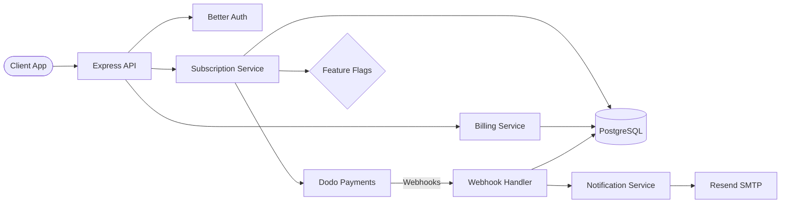

# 💳 Subscription SaaS

> Subscription management platform built with DevLaunchKit — Dodo Payments billing, Better Auth, Resend transactional emails, and feature-flag-gated rollouts.

## Architecture



## Features

- **Subscription lifecycle** — create, upgrade, downgrade, and cancel subscriptions
- **Dodo Payments integration** — payment processing, webhook signature verification, dunning
- **Invoice management** — paginated invoice history with line items
- **Payment method updates** — swap default payment method via API
- **Webhook processing** — handles `subscription.activated`, `subscription.cancelled`, `subscription.renewed`, `invoice.paid`, `invoice.payment_failed`
- **Transactional emails** — Resend-powered notifications for lifecycle events
- **Feature flags** — gate yearly billing and new plan tiers behind gradual rollouts
- **Billing summary** — current plan, next billing date, recent invoices, total spend

## Folder Structure

```
subscription-saas/
├── src/
│   ├── index.ts                  # Express server & route mounting
│   ├── routes/
│   │   ├── subscriptions.ts      # CRUD for subscriptions
│   │   └── billing.ts            # Invoices & payment methods
│   ├── webhooks/
│   │   └── payments.ts           # Dodo webhook handler
│   └── services/
│       └── notifications.ts      # Resend email dispatcher
├── package.json
├── tsconfig.json
└── README.md
```

## Environment Variables

| Variable              | Description                    | Required |
| --------------------- | ------------------------------ | -------- |
| `DATABASE_URL`        | PostgreSQL connection string   | Yes      |
| `DODO_API_KEY`        | Dodo Payments API key          | Yes      |
| `DODO_WEBHOOK_SECRET` | Webhook signature secret       | Yes      |
| `BETTER_AUTH_SECRET`  | Better Auth JWT signing secret | Yes      |
| `RESEND_API_KEY`      | Resend email API key           | Yes      |
| `APP_URL`             | Public application URL         | Yes      |
| `PORT`                | Server port (default: `4002`)  | No       |

## Quick Start

```bash
# 1. Navigate to the example
cd examples/subscription-saas

# 2. Install dependencies
pnpm install

# 3. Configure environment
cp ../../.env.example .env
# Edit .env with your Dodo Payments, Better Auth, and Resend credentials

# 4. Run database migrations
pnpm --filter @devlaunchkit/database db:migrate

# 5. Start the dev server
pnpm dev
```

## API Endpoints

| Method   | Path                          | Description                       |
| -------- | ----------------------------- | --------------------------------- |
| `POST`   | `/api/subscriptions`          | Create a new subscription         |
| `GET`    | `/api/subscriptions/:id`      | Retrieve subscription details     |
| `PATCH`  | `/api/subscriptions/:id`      | Update plan or billing interval   |
| `DELETE` | `/api/subscriptions/:id`      | Cancel subscription at period end |
| `GET`    | `/api/billing/invoices`       | List paginated invoices           |
| `GET`    | `/api/billing/invoices/:id`   | Get invoice with line items       |
| `POST`   | `/api/billing/payment-method` | Update default payment method     |
| `GET`    | `/api/billing/summary`        | Current billing summary           |
| `POST`   | `/webhooks/dodo`              | Dodo Payments webhook receiver    |
| `GET`    | `/health`                     | Health check                      |

## Deployment

```bash
# Build for production
pnpm build

# Start production server
NODE_ENV=production node dist/index.js
```

Configure your Dodo Payments dashboard webhook URL to `https://your-domain.com/webhooks/dodo` and subscribe to all subscription and invoice events.
