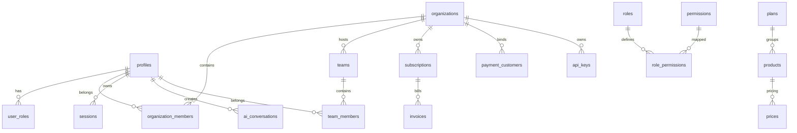

# LaunchKit SaaS Database Architecture Guide

This guide details the database schemas design, relationships, Row Level Security (RLS) templates, and repository patterns configured in `@devlaunchkit/database`.

---

## 🗺️ Entity Relationship (ER) Diagram



---

## 🔒 Row Level Security (RLS) Policy Guide

To support secure multi-tenant isolation, we recommend executing the following RLS policies on the Supabase console or via migration files:

### 1. Enable RLS on Tenant Tables

```sql
ALTER TABLE organizations ENABLE ROW LEVEL SECURITY;
ALTER TABLE organization_members ENABLE ROW LEVEL SECURITY;
ALTER TABLE subscriptions ENABLE ROW LEVEL SECURITY;
ALTER TABLE api_keys ENABLE ROW LEVEL SECURITY;
```

### 2. Tenant Isolation Policy Template

```sql
-- Organization Members can only select/update data belonging to their organization
CREATE POLICY tenant_isolation_policy ON subscriptions
    FOR ALL
    USING (
        organization_id IN (
            SELECT organization_id
            FROM organization_members
            WHERE profile_id = auth.uid()
        )
    );
```

---

## 🛠️ Triggers & Audits

### 1. `updated_at` Timestamp Trigger

To automate timestamp updates, configure the following trigger function:

```sql
CREATE OR REPLACE FUNCTION update_updated_at_column()
RETURNS TRIGGER AS $$
BEGIN
    NEW.updated_at = NOW();
    RETURN NEW;
END;
$$ language 'plpgsql';
```

Apply to tables (e.g. `profiles`, `organizations`):

```sql
CREATE TRIGGER update_profiles_updated_at
    BEFORE UPDATE ON profiles
    FOR EACH ROW
    EXECUTE FUNCTION update_updated_at_column();
```

---

## 📂 Repository Guide

All repository classes inherit from `BaseRepository`, supplying built-in transaction bounds and paging handlers:

```typescript
import { OrganizationRepository } from "@devlaunchkit/database";

const orgRepo = new OrganizationRepository();

// Update tenant configuration
const org = await orgRepo.update("org-id-uuid", {
  name: "Acme Enterprise LLC",
});
```
